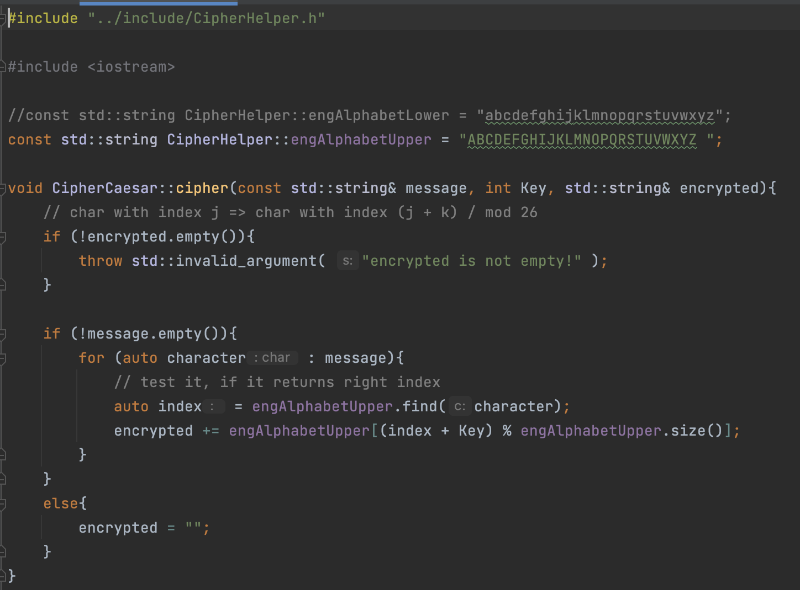
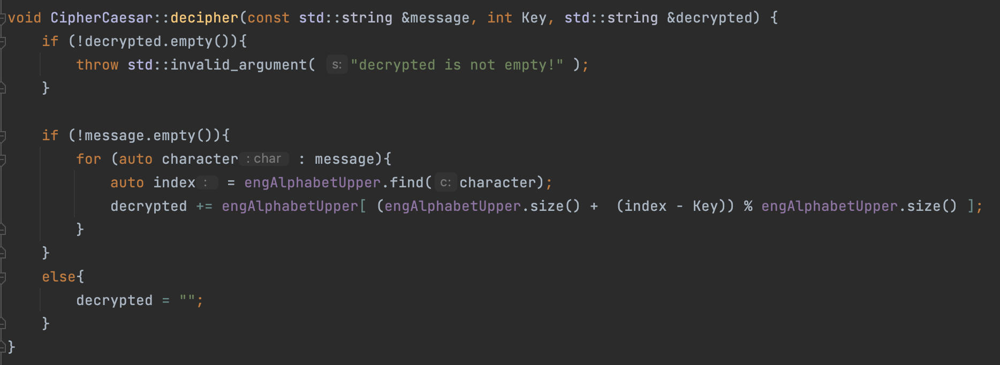
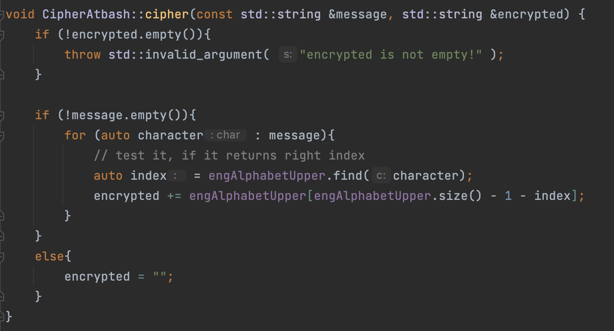
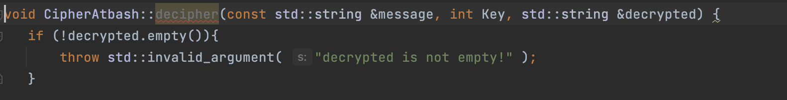
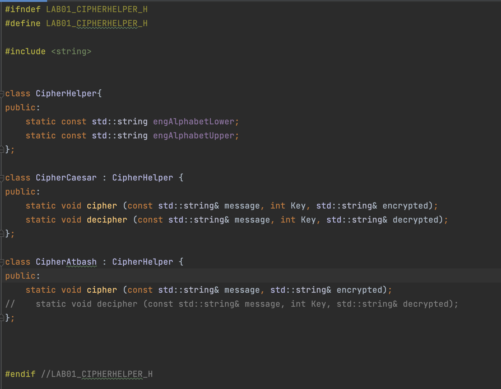
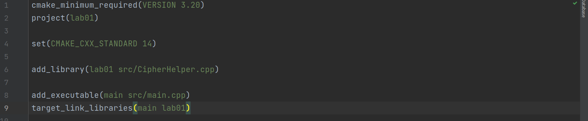
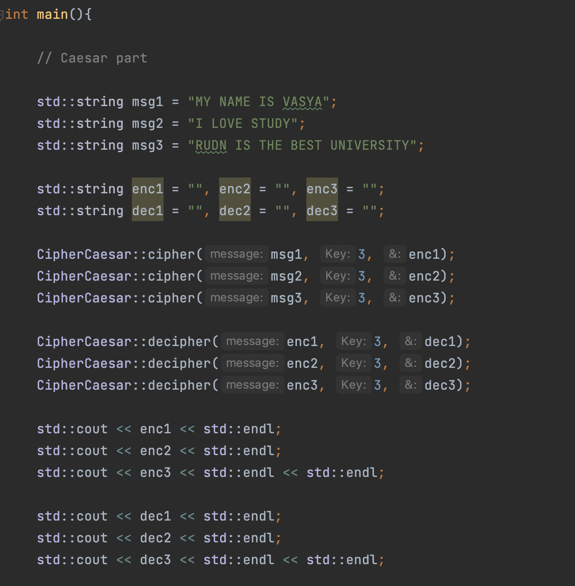
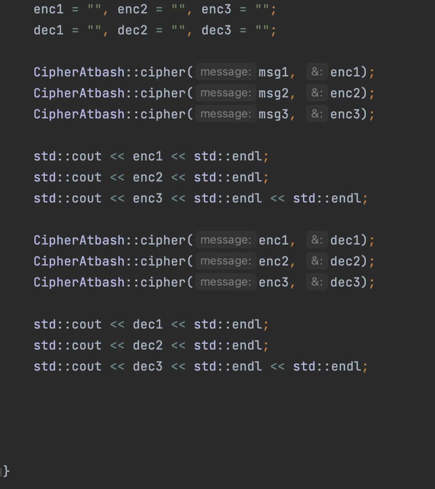

---
## Front matter
lang: ru-RU
title: Лабораторная работа №1
author: |
	Селезнев Василий Александрович - студент группы НПМмд-02-22
date: 16.09.2022

## Formatting
toc: false
slide_level: 2
theme: metropolis
header-includes:
 - \metroset{progressbar=frametitle,sectionpage=progressbar,numbering=fraction}
 - '\makeatletter'
 - '\beamer@ignorenonframefalse'
 - '\makeatother'
aspectratio: 43
section-titles: true
---

# Шифры простой замены

## Прагматика выполнения

Умение пользоваться шифрами Цезаря и Атбаша

## Цель выполнения лабораторной работы

Освоить на практике использование шифров Цезаря и Атбаша

## Задачи выполнения работы

Написать функции, которые реализуют шифрование шифрами Цезаря и Атбаша

## Результаты выполнения лабораторной работы. Часть 1

{ #fig:001 width=70% }

## Написал код для дешивровки кодов шифром Цезаря

{ #fig:002 width=70% }

## Написал код для зашивровки кодов шифром Атбаша

{ #fig:003 width=70% }

## Написал код для дешивровки кодов шифром Атбаша

{ #fig:004 width=70% }

## Написал заголовочный файл для класса реализации CipherHelper

{ #fig:005 width=70% }

## Написал CMakeLists.txt файл, который создаёт библиотеку из класса CipherHelper и бинарник main

{ #fig:006 width=70% }

## Написал main.cpp файл, в котором есть тесты реализованных функций. Часть шифра Цезаря:

{ #fig:007 width=70% }

## Часть шифра Атбаша:

{ #fig:008 width=70% }

## Особенности реализации
- Реализовано на C++, поэтому код быстрый
- Функции статические, поэтому экономятся ресурсы. Особенно это актуально если нам нужно шифровать примерно 1000 сообщений в секунду. Для этих 1000 сообщений не будут создаваться 1000 экземпляров классов
- Все собрано в проект CMake, поэтому код кросс-платформенный

## Выводы

Освоил на практике применение шифрования шифрами Цезаря и Атбаш.
